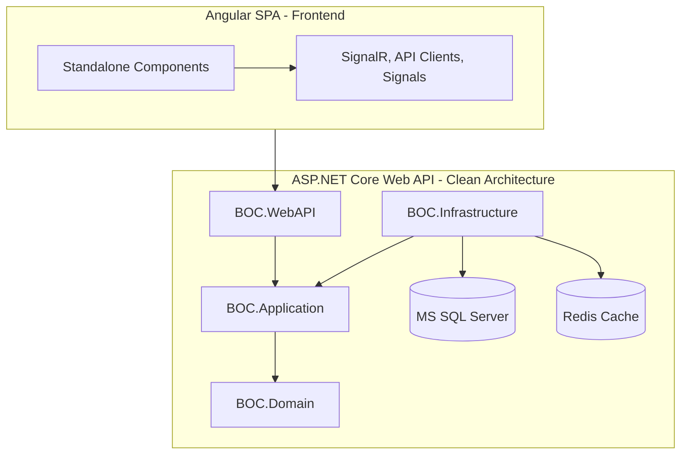

# BOC Research Evaluation & Workflow Management System — Implementation Plan

This implementation plan outlines the development phases, architectural structure, and technical components for the Basrah Oil Company (BOC) Research Evaluation & Workflow Management System, following the **v11 Unified Master Blueprint**.

Having successfully deployed the MS SQL Server DDL (`BOC_PhaseA_SQL_DDL_v11_FIXED.sql`), the database schema is fully established. The next phases involve implementing the backend solution, domain services, security components, and the decoupled frontend client.

---

## User Review Required

> [!IMPORTANT]
> **PII Encryption Requirement:** The database schema has deterministic encrypted columns for `NationalID` and `EmployeeID`. The backend must configure the Azure Key Vault or local Column Master Key (CMK) / Column Encryption Key (CEK) provider to perform transparent Always Encrypted mapping.
> Please confirm if Azure Key Vault or a local Windows Certificate Store will be used for hosting the Column Master Key.

> [!WARNING]
> **Email and SFTP Integration:** The background jobs (`EmailDispatcherJob`, `MinistryBatchPollerJob`) require an SMTP gateway and an SFTP server. Mock implementations will be used in development and overridden by environment configurations in production.

---

## Open Questions

1. **2FA Enforcement**: Should 2FA setup be mandatory immediately upon first user login for Administrative roles, blocking all actions until configured, or is there a grace period?
2. **Always Encrypted Certificate**: Do you already have a Certificate or Key Vault configured for Always Encrypted in your local environment? If not, we will configure the connection string to bypass encryption for dev testing or generate a local self-signed Column Master Key.

---

## Proposed Changes

We will organize the code into the `backend/` and `frontend/` directories.

---

### Component 1: Backend Solution Structure

Establish the Clean Architecture Solution structure within `backend/`.

#### [NEW] [BOC.sln](file:///d:/WebApps/BOC_Research_System/backend/BOC.sln)
Create the Visual Studio Solution file linking the projects.

#### [NEW] [BOC.Domain](file:///d:/WebApps/BOC_Research_System/backend/BOC.Domain/BOC.Domain.csproj)
Define domain aggregates, entities, enums, value objects, domain exceptions, and domain events.
- **Entities**: `ResearchPaper`, `AppUser`, `Meeting`, `MeetingMinutes`, `EvaluatorAssignment`, `AuditLog`, `OutboxMessage`.
- **Value Objects**: `ResearchScore`, `ResearchState`, `EmployeeIdentity`.
- **Events**: `ResearchSubmittedEvent`, `ResearchStateChangedEvent`, `SLABreachedEvent`, `MinutesFrozenEvent`.

#### [NEW] [BOC.Application](file:///d:/WebApps/BOC_Research_System/backend/BOC.Application/BOC.Application.csproj)
Define application interfaces, DTOs, AutoMapper profiles, FluentValidation rules, MediatR commands/queries, and behaviors.
- **CQRS Handlers**: `SubmitResearchCommandHandler`, `TriageAssignCommandHandler`, `GradeSubmitCommandHandler`.
- **Pipeline Behaviors**: `ValidationBehavior`, `LoggingBehavior`, `TransactionBehavior`.

#### [NEW] [BOC.Infrastructure](file:///d:/WebApps/BOC_Research_System/backend/BOC.Infrastructure/BOC.Infrastructure.csproj)
Implement external interfaces, database access, background jobs, caching, and integrations.
- **EF Core DbContext**: `BOCDbContext` mapping the 35+ tables.
- **Configurations**: Fluent API configurations (`AppUserConfiguration`, `ResearchPaperConfiguration`, etc.) implementing optimistic concurrency `RowVersion`, restrictive deletes, and Always Encrypted mapping.
- **Redis Cache**: Implementation of `IDistributedCache` for permissions and workload queries.
- **Quartz Jobs**: `OutboxDispatcherJob`, `SLABreachScannerJob`, `RetirementAgeScannerJob`.
- **Services**: `SftpFtpProxyService`, `ClamAvVirusScanner`.

#### [NEW] [BOC.WebAPI](file:///d:/WebApps/BOC_Research_System/backend/BOC.WebAPI/BOC.WebAPI.csproj)
Define the entry point, controllers, API routing, middlewares, dependency injection registrations, and real-time hubs.
- **Hubs**: `NotificationHub` and `ChatHub`.
- **Controllers**: `AuthController`, `ResearchController`, `MeetingController`, `TriageController`.
- **Middlewares**: `GlobalExceptionMiddleware` (RFC 7807 ProblemDetails), `RateLimitingMiddleware`.

---

### Component 2: Core Domain Logic & Business Rules

Implement the business engines described in the blueprint.

#### [NEW] [ResearchScoringService.cs](file:///d:/WebApps/BOC_Research_System/backend/BOC.Domain/Services/ResearchScoringService.cs)
Calculates the final score based on the 70/30 formula:
$$\text{Final Score} = \left( \frac{\sum \text{Evaluator Scores}}{\text{Number of Evaluators}} \times 0.7 \right) + \text{Chairman Score (Max 30)}$$

#### [NEW] [vw_EligibleEvaluators.sql](file:///d:/WebApps/BOC_Research_System/backend/BOC.Infrastructure/Persistence/Views/vw_EligibleEvaluators.sql)
Map the custom view in EF Core to support the evaluator picker, sorting by:
- **Tier 1**: Never assigned
- **Tier 2**: Active load == 0, sorted by oldest `LastAssignedDate`
- **Tier 3**: Active load > 0, sorted by load count ascending
- Apply department and directorate anti-conflict filters.

#### [NEW] [ResearchStateMachine.cs](file:///d:/WebApps/BOC_Research_System/backend/BOC.Domain/Fsm/ResearchStateMachine.cs)
State transition engine enforcing the 14-state legal matrix:
- Throws `InvalidStateTransitionException` (HTTP 409) on illegal transitions.

---

### Component 3: Security, Audit, and Outbox Pattern

Enforce system security and reliable messaging.

#### [NEW] [AuditLogInterceptor.cs](file:///d:/WebApps/BOC_Research_System/backend/BOC.Infrastructure/Persistence/Interceptors/AuditLogInterceptor.cs)
An EF Core `SaveChangesInterceptor` that automatically captures differences in entities and writes JSON diffs (`OldValueJSON` and `NewValueJSON`) to `AuditLogs`.

#### [NEW] [OutboxInterceptor.cs](file:///d:/WebApps/BOC_Research_System/backend/BOC.Infrastructure/Persistence/Interceptors/OutboxInterceptor.cs)
Intercepts domain events emitted during business transactions and serializes them into the `OutboxMessages` table as part of the same SQL transaction.

---

### Component 4: Frontend Client (Angular 17+)

Setup the decoupled SPA client in `frontend/`.

#### [NEW] [package.json](file:///d:/WebApps/BOC_Research_System/frontend/package.json)
Angular 17+ dependencies including `@angular/material`, `rxjs`, `apexcharts`, `ngx-translate`, and `ngx-hijri-date`.

#### [NEW] [styles.scss](file:///d:/WebApps/BOC_Research_System/frontend/src/styles.scss)
Design tokens utilizing the **Muted Industrial Theme**:
- Oil Blue: `#0F2A38` and `#163E54`
- Slate Gray: `#4A607A`
- Off-White: `#F4F6F9`
- Font: Tajawal (Arabic) and Segoe UI (English).

#### [NEW] [triage-dashboard](file:///d:/WebApps/BOC_Research_System/frontend/src/app/pages/triage-dashboard/triage-dashboard.component.ts)
Incoming Triage Screen with real-time SignalR status badges, eligible evaluator tiered list picker, and PDF document streaming proxy viewer.

#### [NEW] [meeting-studio](file:///d:/WebApps/BOC_Research_System/frontend/src/app/pages/meeting-studio/meeting-studio.component.ts)
Physical committee meeting manager with live voting, attendance trackers, and rich text compiler for the **5 BOC Sections** of Meeting Minutes.

---

## Verification Plan

### Automated Tests
1. **Unit Tests (Domain)**:
   - Verify state machine transitions (e.g., Draft -> Pending_Secretary_Screening is legal; Archived -> Draft throws exception).
   - Verify the 70/30 scoring formula matches decimal expectations.
   - Verify the anti-conflict filter criteria.
2. **Integration Tests (Infrastructure)**:
   - Run tests against a local test instance of SQL Server to verify EF Core mappings, computed columns, and foreign keys.
   - Verify outbox message processing and Redis caching invalidation.

### Manual Verification
- Deploy the system in development mode and simulate the workflow:
  1. Login as Researcher and upload draft paper.
  2. Log in as Secretary, pass screening, and move to Incoming Triage.
  3. Log in as Chairman, assign evaluators based on the Tiered Workload balancer.
  4. Submit evaluations, calculate final score, freeze minutes, and verify audit log generation.
