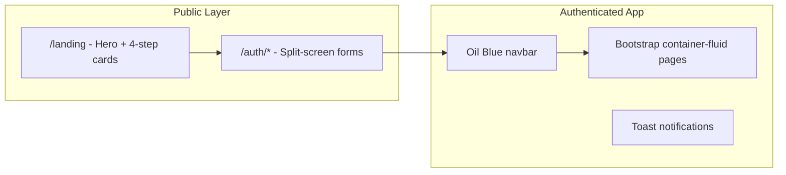
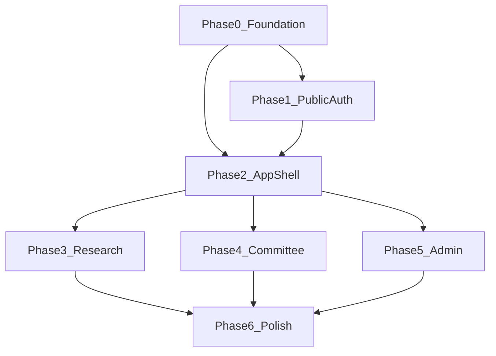

# BOC Research System — Modern UI/UX Regeneration Plan

## Current Frontend Analysis

### Stack & Architecture
- **Framework:** Angular 21 standalone SPA ([`frontend/src/app/app.routes.ts`](frontend/src/app/app.routes.ts))
- **Styling:** Bootstrap 5.3 + global SCSS ([`frontend/src/styles.scss`](frontend/src/styles.scss)) + 21 page-level SCSS files
- **Charts:** ApexCharts (home + admin analytics)
- **Onboarding:** Driver.js tour on `/home` ([`frontend/src/app/services/onboarding.service.ts`](frontend/src/app/services/onboarding.service.ts))
- **31 page components**, only 2 shared UI components (`navbar`, `toast-container`)

### Color Palette (KEEP — no changes)
| Token | Value | Role |
|---|---|---|
| Oil Blue | `#0F2A38` | Primary text, navbar, CTAs |
| Oil Blue Light | `#163E54` | Hover / secondary headings |
| Slate Gray | `#4A607A` | Muted text, borders |
| Off-White | `#F4F6F9` | Page background |
| Surface White | `#FFFFFF` | Cards, panels |
| Status | `#28a745` / `#ffc107` / `#dc3545` / `#17a2b8` | Success / warning / danger / info |

### Current UI Patterns (What exists today)



**Strengths**
- RTL-first with Tajawal font
- Login already uses split-screen layout ([`login.component.html`](frontend/src/app/pages/login/login.component.html))
- Landing has hero + onboarding explainer section
- Consistent Oil Blue brand in navbar

**Critical Gaps (must fix during modernization)**
1. **Broken templates:** [`register.component.html`](frontend/src/app/pages/register/register.component.html) and [`forgot-password.component.html`](frontend/src/app/pages/forgot-password/forgot-password.component.html) have merged duplicate markup
2. **Incomplete 2FA:** [`two-factor.component.html`](frontend/src/app/pages/two-factor/two-factor.component.html) missing OTP input + submit
3. **Missing assets:** `assets/boc_logo.png`, `assets/boc_login_bg.png` referenced but not in repo
4. **Undefined CSS tokens:** `--primary-oil-blue`, `--border-radius`, `--glass-card` used in components but not defined in `:root`
5. **Referenced but unstyled classes:** `.glass-card`, `.dashboard-bg`, `.dark-mode` used in HTML/TS with no CSS
6. **Bootstrap Icons not imported** — `bi bi-*` classes likely render empty
7. **Heavy inline styles** instead of design tokens on ~80% of admin pages
8. **No shared component library** — every page reimplements buttons, headers, cards, tables

### Style Assessment
The UI is **functional but inconsistent**: a partial migration to split-screen auth and glass-card dashboards without completing the design system. Pages feel like wireframes with Bootstrap defaults mixed with custom BOC colors. The blueprint's "Premium Enterprise" vision ([`workflow/implementation_plan.md`](workflow/implementation_plan.md)) is ~40% implemented.

---

## Target Modern Design Language

**Approach:** Hybrid — **Bootstrap 5 for layout/grid/responsive shell** + **Angular Material for forms, dialogs, tables, steppers, snackbars**.

**Visual direction (colors unchanged):**
- Soft elevation shadows (not flat Bootstrap defaults)
- Subtle glassmorphism on auth panels and dashboard cards (frosted white over Oil Blue gradients)
- Consistent 6px border-radius, 200ms ease transitions
- Icon-led input groups with focus rings in Oil Blue
- Page headers as unified "PageHero" strip (white surface, left Oil Blue accent bar)
- Data tables with hover rows, status chips, empty states
- Micro-interactions: button press scale, card hover lift, skeleton loaders

---

## Style Reference Symbols (Target Screens)

### Login Page — Target Layout

```
┌─────────────────────────────────────────────────────────────────────┐
│  RTL Split-Screen (min-vh-100)                                      │
│                                                                     │
│  ┌──────────────────────────┐  ┌─────────────────────────────────┐ │
│  │  FORM PANEL (45%)        │  │  VISUAL PANEL (55%, lg+)        │ │
│  │  bg: white + glass edge  │  │  bg: boc_login_bg.png           │ │
│  │                          │  │  overlay: Oil Blue gradient     │ │
│  │  [BOC Logo 64px]         │  │                                 │ │
│  │  تسجيل الدخول            │  │  floating glass badge:          │ │
│  │  subtitle muted          │  │  "نظام إدارة البحوث"            │ │
│  │                          │  │                                 │ │
│  │  ┌─ email (MatFormField) │  │  subtle animated data nodes     │ │
│  │  └─ password             │  │  (CSS only, no color change)    │ │
│  │  [نسيت كلمة المرور؟]     │  │                                 │ │
│  │                          │  │                                 │ │
│  │  (●) تسجيل الدخول pill   │  │                                 │ │
│  │  ─── or ───              │  │                                 │ │
│  │  إنشاء حساب باحث         │  │                                 │ │
│  └──────────────────────────┘  └─────────────────────────────────┘ │
│                                                                     │
│  Mobile: form full-width, visual panel hidden, Oil Blue top strip  │
└─────────────────────────────────────────────────────────────────────┘
```

**Key elements:** MatFormField outlined inputs, pill CTA (`btn-primary-industrial`), glass edge shadow on form panel, cinematic right panel with existing palette gradient.

### Onboarding — Two Surfaces

**A) Public Landing Onboarding Section (`/landing#onboarding`)**

```
┌─────────────────────────────────────────────────────────────────────┐
│  bg: white, py-5                                                    │
│  "دليلك لاستخدام النظام"  +  subtitle                             │
│                                                                     │
│  ┌──────────┐  ┌──────────┐  ┌──────────┐  ┌──────────┐           │
│  │ (1) 👤+  │  │ (2) 📄↑  │  │ (3) 🔍   │  │ (4) ✅   │           │
│  │ إنشاء    │  │ تقديم    │  │ مراجعة   │  │ اعتماد   │           │
│  │ الحساب   │  │ البحث    │  │ وتقييم   │  │ نهائي    │           │
│  │          │  │          │  │          │  │          │           │
│  │ hover:   │  │ hover:   │  │ hover:   │  │ hover:   │           │
│  │ lift+    │  │ lift+    │  │ lift+    │  │ lift+    │           │
│  │ shadow   │  │ shadow   │  │ shadow   │  │ shadow   │           │
│  └──────────┘  └──────────┘  └──────────┘  └──────────┘           │
│  connector line between steps (desktop only)                        │
└─────────────────────────────────────────────────────────────────────┘
```

**B) Post-Login First-Visit Welcome (`/home` — new optional welcome card before Driver.js tour)**

```
┌─────────────────────────────────────────────────────────────────────┐
│  glass-card welcome banner (replaces current plain card)            │
│  ┌─────────────────────────────────────────────────────────────┐   │
│  │  "مرحباً، {name}"  + role chip                               │   │
│  │  3 quick-start tiles: [تقديم بحث] [متابعة] [الملف الشخصي]   │   │
│  │  [ابدأ الجولة التعريفية →]  (triggers Driver.js)            │   │
│  └─────────────────────────────────────────────────────────────┘   │
└─────────────────────────────────────────────────────────────────────┘
```

---

## Architecture: New Shared UI Layer

Create a lightweight component library under [`frontend/src/app/shared/`](frontend/src/app/shared/):

| Component | Purpose |
|---|---|
| `boc-page-hero` | Unified page header with accent bar, title, breadcrumbs, actions |
| `boc-stat-card` | KPI card with icon, value, trend badge |
| `boc-glass-card` | Frosted card wrapper (implements missing `.glass-card`) |
| `boc-status-chip` | Semantic status badges (Draft, Under Review, SLA Breach…) |
| `boc-empty-state` | Illustration + message + CTA for empty tables/lists |
| `boc-data-table` | MatTable wrapper with BOC theme, pagination, sort |
| `boc-auth-shell` | Shared split-screen layout for all auth pages |
| `boc-form-field` | MatFormField + Bootstrap icon prefix, RTL-aware |

Extend [`frontend/src/styles.scss`](frontend/src/styles.scss) with a complete token map:

```scss
:root {
  /* existing --boc-* colors unchanged */
  --boc-radius-sm: 4px;
  --boc-radius-md: 6px;
  --boc-radius-lg: 8px;
  --boc-shadow-sm: 0 1px 3px rgba(15,42,56,0.08);
  --boc-shadow-md: 0 4px 12px rgba(15,42,56,0.12);
  --boc-glass-bg: rgba(255,255,255,0.85);
  --boc-glass-blur: 12px;
  --boc-transition: 0.2s ease-in-out;
  /* alias legacy tokens */
  --primary-oil-blue: var(--boc-primary);
  --border-radius: var(--boc-radius-md);
}
```

Add Angular Material with custom theme mapping Material palette → BOC colors ([`frontend/src/styles/_material-theme.scss`](frontend/src/styles/_material-theme.scss)).

---

## Phased Execution Plan

> **How to proceed:** Say **"continue"** to execute the next phase only. Each phase is self-contained and verifiable before moving on.

---

### Phase 0 — Design System Foundation
**Goal:** Install dependencies, unify tokens, build shared components, fix global infrastructure.

**Tasks:**
1. Install `@angular/material`, `@angular/cdk`, `bootstrap-icons`; import icons in [`styles.scss`](frontend/src/styles.scss)
2. Create BOC Material theme (primary = `#0F2A38`, accent = `#4A607A`, warn = `#dc3545`)
3. Expand `:root` tokens + implement `.glass-card`, `.dashboard-bg`, `.dark-mode` variants
4. Build shared components: `boc-auth-shell`, `boc-page-hero`, `boc-glass-card`, `boc-stat-card`, `boc-status-chip`, `boc-empty-state`
5. Add/regenerate assets: `boc_logo.png`, `boc_login_bg.png` (abstract petroleum/data art, Oil Blue tones)
6. Create `BocLayoutService` for consistent page padding, title, and breadcrumb state

**Deliverable:** Shared library usable by all pages; no page redesign yet except verifying tokens in Storybook-style demo route (optional) or login smoke test.

---

### Phase 1 — Public & Auth Surfaces
**Goal:** Modernize landing + all auth flows using `boc-auth-shell`.

**Pages:**
- [`landing.component.*`](frontend/src/app/pages/landing/)
- [`login.component.*`](frontend/src/app/pages/login/)
- [`register.component.*`](frontend/src/app/pages/register/) — **fix broken HTML**
- [`two-factor.component.*`](frontend/src/app/pages/two-factor/) — **complete OTP UI**
- [`forgot-password.component.*`](frontend/src/app/pages/forgot-password/) — **fix broken HTML**
- [`reset-password.component.*`](frontend/src/app/pages/reset-password/)
- [`errors/not-found`](frontend/src/app/pages/errors/not-found/), [`errors/access-denied`](frontend/src/app/pages/errors/access-denied/)

**Changes:**
- All auth pages share split-screen shell with glass form panel
- Replace raw Bootstrap inputs with Material outlined fields + icon prefixes
- Landing hero: full-bleed background, refined typography, animated onboarding step cards with connector line
- Error pages: branded illustration + back/home CTAs

**Deliverable:** Login + onboarding landing match style symbols above; all auth pages functional and visually consistent.

---

### Phase 2 — App Shell & Dashboards
**Goal:** Modern authenticated experience — navbar, home, profile, notifications.

**Pages:**
- [`navbar.component.*`](frontend/src/app/components/navbar/)
- [`home-dashboard.component.*`](frontend/src/app/pages/home-dashboard/)
- [`user-profile.component.*`](frontend/src/app/pages/user-profile/)
- [`notifications.component.*`](frontend/src/app/pages/notifications/)
- [`toast-container.component.*`](frontend/src/app/components/toast-container/)

**Changes:**
- Navbar: subtle blur backdrop, active link indicator, improved notification badge, mobile drawer
- Home: implement glass welcome banner, stat cards, quick-action tiles with role-based colors tokenized (replace inline `#E37400`, `#8430CE`)
- Profile: preferences panel with working dark mode toggle (implement `.dark-mode` CSS)
- Driver.js tour: restyle popover to match new glass card aesthetic

**Deliverable:** Post-login experience feels modern and cohesive; dark mode functional.

---

### Phase 3 — Research Workflow UI
**Goal:** Polished researcher journey.

**Pages:**
- [`submit-research`](frontend/src/app/pages/submit-research/)
- [`researcher-history`](frontend/src/app/pages/researcher-history/)
- [`research-timeline`](frontend/src/app/pages/research-timeline/)
- [`research-corrections`](frontend/src/app/pages/research-corrections/)

**Changes:**
- Submission: Material stepper wizard with progress indicator
- History: `boc-data-table` with status chips, filters, empty state
- Timeline: interactive vertical timeline component (replace static tables)
- Corrections: secretary notes panel + upload zone with drag-drop styling

**Deliverable:** Research flows match enterprise SaaS quality.

---

### Phase 4 — Committee & Evaluator Tools
**Goal:** Modernize operational workspaces.

**Pages:**
- [`triage-dashboard`](frontend/src/app/pages/triage-dashboard/) + fix missing `/triage` route in [`app.routes.ts`](frontend/src/app/app.routes.ts)
- [`committee-workspace`](frontend/src/app/pages/committee-workspace/)
- [`evaluator-portfolio`](frontend/src/app/pages/evaluator-portfolio/)
- [`meeting-scheduler`](frontend/src/app/pages/meeting-scheduler/), [`meeting-studio`](frontend/src/app/pages/meeting-studio/), [`rsvp`](frontend/src/app/pages/rsvp/)
- [`chat`](frontend/src/app/pages/chat/)

**Changes:**
- Triage: SignalR live badges + action panel with Material dialogs
- Committee workspace: split PDF viewer + scoring panel layout
- Meeting studio: section tabs for 5 BOC minutes sections
- Chat: modern message bubbles, RTL-aware

**Deliverable:** Committee/evaluator screens production-ready.

---

### Phase 5 — Admin & Governance UI
**Goal:** Executive and admin tools with unified data-grid experience.

**Pages (10 admin screens):**
- [`analytics-dashboard`](frontend/src/app/pages/admin/analytics-dashboard/)
- [`evaluator-roster`](frontend/src/app/pages/admin/evaluator-roster/)
- [`audit-logs`](frontend/src/app/pages/admin/audit-logs/)
- [`sla-violations`](frontend/src/app/pages/admin/sla-violations/)
- [`plagiarism-override`](frontend/src/app/pages/admin/plagiarism-override/)
- [`ministry-gateway`](frontend/src/app/pages/admin/ministry-gateway/)
- [`global-search`](frontend/src/app/pages/admin/global-search/)
- [`export-hub`](frontend/src/app/pages/admin/export-hub/)
- [`system-config`](frontend/src/app/pages/admin/system-config/)

**Changes:**
- Unified `boc-page-hero` + `boc-stat-card` row on every admin page
- Replace placeholder charts with themed ApexCharts (BOC color series)
- `boc-data-table` with row hover, column sort, pagination across all grids
- Audit log: JSON diff viewer in Material expansion panels

**Deliverable:** Admin suite visually consistent with dashboards.

---

### Phase 6 — Polish, Accessibility & QA
**Goal:** Production hardening.

**Tasks:**
1. WCAG 2.1 AA pass: focus rings, contrast verification, aria labels on icon-only buttons
2. Responsive audit: all 31 pages at 375px / 768px / 1280px
3. Remove dead SCSS (e.g. unused `.login-card` in [`login.component.scss`](frontend/src/app/pages/login/login.component.scss))
4. Replace remaining inline `style=` with token classes
5. Update [`capture_all.js`](frontend/capture_all.js) route list; generate before/after screenshots
6. Wire `authGuard` on protected routes (currently imported but unused)

**Deliverable:** Full UI regression pass, screenshot baseline, accessibility checklist.

---

## Phase Dependency Graph



---

## Key Files to Create/Modify

| Action | Path |
|---|---|
| Extend | [`frontend/src/styles.scss`](frontend/src/styles.scss) |
| Create | `frontend/src/styles/_tokens.scss`, `_material-theme.scss`, `_glass.scss`, `_dark-mode.scss` |
| Create | `frontend/src/app/shared/` component library (~8 components) |
| Modify | All 31 page components (phased) |
| Fix | [`frontend/src/app/app.routes.ts`](frontend/src/app/app.routes.ts) — triage route + authGuard |
| Add assets | `frontend/src/assets/boc_logo.png`, `boc_login_bg.png` |

---

## Success Criteria

- Muted Industrial colors preserved exactly (`#0F2A38`, `#163E54`, `#4A607A`, `#F4F6F9`)
- Login and onboarding match the style symbols above
- Zero broken HTML templates
- Shared components eliminate duplicated page header/card/table code
- Hybrid stack: Bootstrap grid + Material forms/tables/dialogs
- Each phase independently testable via `ng serve` before proceeding

---

## Execution Protocol

When you say **"continue"**, I will:
1. Execute **only the next pending phase** (starting with Phase 0)
2. Show a brief summary of changes made
3. List verification steps (pages to open, what to check)
4. Wait for your next **"continue"** before starting the following phase
