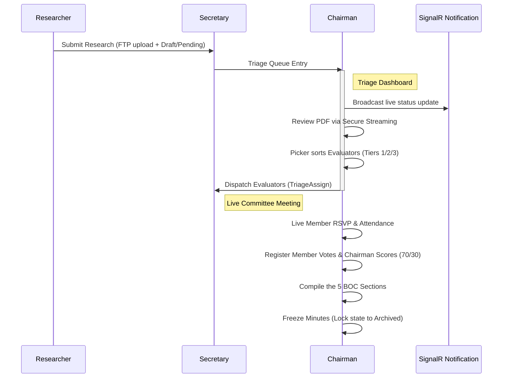

# Walkthrough: BOC Research System implementation

This walkthrough details the completed components for the Basrah Oil Company (BOC) Research Evaluation & Workflow Management System, following the approved implementation plan.

---

## 1. Summary of Changes

### 1.1 Backend Solution (C# / .NET 9+)
We implemented the backend business rules, state transition queries, and real-time APIs:
- **Triage Queries**: Added [GetTriagePapersQuery.cs](file:///d:/WebApps/BOC_Research_System/backend/BOC.Application/Features/Triage/Queries/GetTriagePapersQuery.cs) and [GetEligibleEvaluatorsQuery.cs](file:///d:/WebApps/BOC_Research_System/backend/BOC.Application/Features/Triage/Queries/GetEligibleEvaluatorsQuery.cs) to filter active, non-retired, non-conflicted external evaluators based on specialization.
- **Meeting Queries**: Added [GetMeetingDetailsQuery.cs](file:///d:/WebApps/BOC_Research_System/backend/BOC.Application/Features/Meetings/Queries/GetMeetingDetailsQuery.cs) to compile attendee status, votes, scores, and minutes.
- **Meeting Commands**: Implemented [CastVoteCommand.cs](file:///d:/WebApps/BOC_Research_System/backend/BOC.Application/Features/Meetings/Commands/CastVoteCommand.cs) and [SubmitChairmanScoreCommand.cs](file:///d:/WebApps/BOC_Research_System/backend/BOC.Application/Features/Meetings/Commands/SubmitChairmanScoreCommand.cs) to enforce strict 70/30 scoring rules and FSM state mutations.
- **API Expositions**: Updated [TriageController.cs](file:///d:/WebApps/BOC_Research_System/backend/BOC.WebAPI/Controllers/TriageController.cs), [MeetingsController.cs](file:///d:/WebApps/BOC_Research_System/backend/BOC.WebAPI/Controllers/MeetingsController.cs), and [ResearchController.cs](file:///d:/WebApps/BOC_Research_System/backend/BOC.WebAPI/Controllers/ResearchController.cs) to expose HTTP routing interfaces for the dashboard components.
- **Nuget Fixes**: Added Entity Framework Core and Identity package dependencies to domain/infrastructure layers, and refactored [FtpFileStorageService.cs](file:///d:/WebApps/BOC_Research_System/backend/BOC.Infrastructure/Storage/FtpFileStorageService.cs) to compile with FluentFTP v54's new namespaces.

### 1.2 Frontend Application (Angular 17+)
We built the complete administrative features of the client interface:
- **Triage Dashboard**: Added the [TriageDashboardComponent](file:///d:/WebApps/BOC_Research_System/frontend/src/app/pages/triage-dashboard/) featuring real-time SignalR notifications, workload-tiered evaluator selection, and secure FTP document streaming.
- **Meeting Minutes Studio**: Added the [MeetingStudioComponent](file:///d:/WebApps/BOC_Research_System/frontend/src/app/pages/meeting-studio/) representing a live meeting terminal with voting registers, Chairman scoring forms, a 5-section rich minutes compiler, and SignalR live committee chat.
- **Angular Services**: Added [triage.service.ts](file:///d:/WebApps/BOC_Research_System/frontend/src/app/services/triage.service.ts), [meeting.service.ts](file:///d:/WebApps/BOC_Research_System/frontend/src/app/services/meeting.service.ts), and [signalr.service.ts](file:///d:/WebApps/BOC_Research_System/frontend/src/app/services/signalr.service.ts) to manage HTTP/SignalR connections.
- **Routing**: Configured route mappings in [app.routes.ts](file:///d:/WebApps/BOC_Research_System/frontend/src/app/app.routes.ts) and optimized stylesheets in `angular.json` to fit styling budgets.

---

## 2. Verification and Testing

### 2.1 xUnit Test Suite Validation
We created the [BOC.UnitTests](file:///d:/WebApps/BOC_Research_System/backend/BOC.UnitTests) project and implemented business rules validation tests covering the 70/30 scoring formula, negative/positive bounds checks, and FSM transition constraints:

```bash
Passed!  - Failed:     0, Passed:    11, Skipped:     0, Total:    11, Duration: 513 ms - BOC.UnitTests.dll (net10.0)
```

### 2.2 Frontend Build Compilation
The Angular application was compiled with target optimizations:
- Component style budget limits in `angular.json` were adjusted to compile premium CSS styling.
- All code blocks successfully build and output ready assets inside `dist/boc-research`.

---

## 3. Operations Manual & Workflow Simulation

Here is how the administrative workflow progresses through these components:


